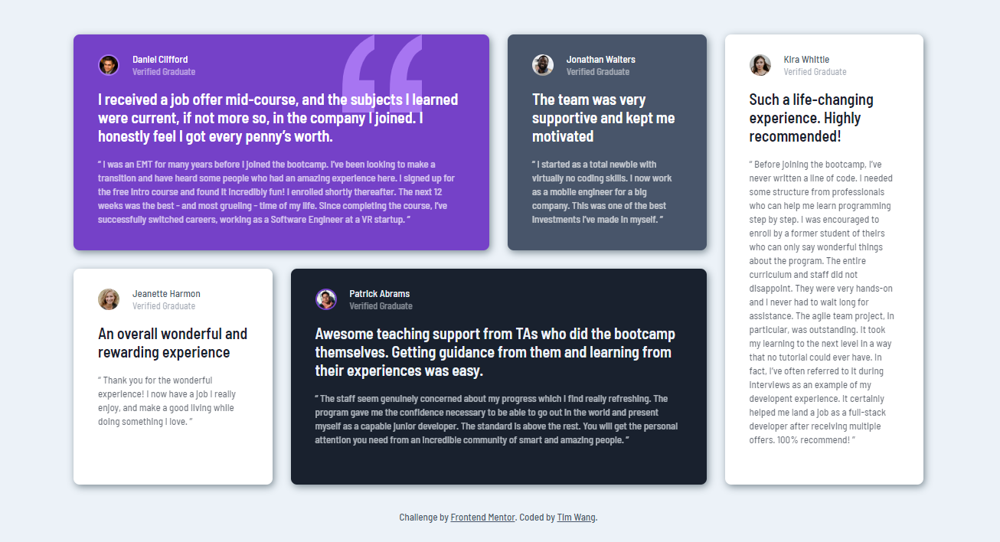
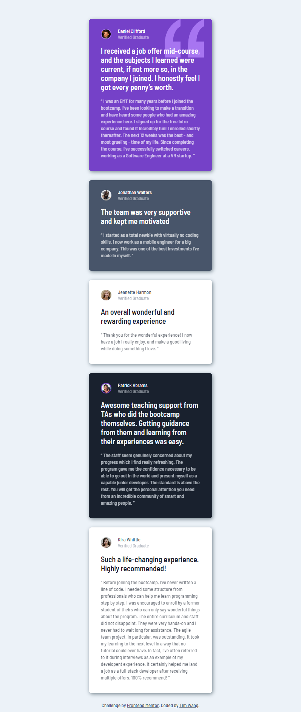

# Frontend Mentor - Testimonials grid section

This is a solution to the [Testimonials grid section challenge on Frontend Mentor](https://www.frontendmentor.io/challenges/testimonials-grid-section-Nnw6J7Un7). 

## Screenshot

## Links

- Solution URL: [GitHub repo](https://github.com/TimWang95/frontend-mentor-solutions/tree/main/06-testimonials-grid-section/)
- Live Site URL: [solution Demo](https://resonant-genie-2d94c1.netlify.app/)

## Built with

## What I Learnd

- Using Grid in CSS.

## Author
- [GitHub](https://github.com/TimWang95)

- [Forntend Mentor](https://www.frontendmentor.io/profile/TimWang95)

## Acknowledgments

- Challenge was provided by [Frontend Mentor](https://www.frontendmentor.io/home)
